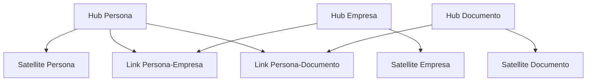

# Metodología Data Vault 2.0 - SIRE

## Visión General

El sistema SIRE implementa la metodología Data Vault 2.0 para el diseño y construcción del Data Warehouse. Esta metodología proporciona un enfoque escalable, flexible y auditable para el almacenamiento de datos empresariales.

## Principios de Data Vault 2.0

### 1. Escalabilidad

- ✅ **Diseño horizontal**: Permite agregar nuevas fuentes de datos sin afectar las existentes
- ✅ **Particionamiento**: Soporte para grandes volúmenes de datos
- ✅ **Paralelización**: Procesamiento paralelo de datos
- ✅ **Distribución**: Soporte para arquitecturas distribuidas

### 2. Flexibilidad

- ✅ **Cambios de esquema**: Adaptación a cambios en fuentes de datos
- ✅ **Nuevas fuentes**: Integración fácil de nuevas fuentes
- ✅ **Evolución**: Soporte para evolución del modelo de datos
- ✅ **Agilidad**: Respuesta rápida a cambios de negocio

### 3. Auditoría

- ✅ **Trazabilidad**: Seguimiento completo de cambios
- ✅ **Histórico**: Preservación de datos históricos
- ✅ **Metadatos**: Información detallada sobre origen y procesamiento
- ✅ **Compliance**: Cumplimiento de regulaciones

## Componentes del Data Vault

### 1. Hubs (Concentradores)

**Propósito**: Almacenan las claves de negocio únicas y metadatos básicos.

**Características**:
- ✅ Claves de negocio únicas
- ✅ Metadatos de carga
- ✅ Información de origen
- ✅ Timestamps de auditoría

**Ejemplo - Hub Persona**:
```sql
CREATE TABLE sire_dv.hub_persona (
    hub_persona_key VARCHAR2(50) PRIMARY KEY,
    tipo_documento VARCHAR2(10) NOT NULL,
    numero_documento VARCHAR2(20) NOT NULL,
    hash_key VARCHAR2(64) NOT NULL,
    load_date DATE DEFAULT SYSDATE,
    record_source VARCHAR2(100) DEFAULT 'SIRE_ETL'
);
```

**Ejemplo - Hub Empresa**:
```sql
CREATE TABLE sire_dv.hub_empresa (
    hub_empresa_key VARCHAR2(50) PRIMARY KEY,
    tipo_documento VARCHAR2(10) NOT NULL,
    numero_documento VARCHAR2(20) NOT NULL,
    hash_key VARCHAR2(64) NOT NULL,
    load_date DATE DEFAULT SYSDATE,
    record_source VARCHAR2(100) DEFAULT 'SIRE_ETL'
);
```

### 2. Satellites (Satélites)

**Propósito**: Almacenan atributos descriptivos y cambios históricos.

**Características**:
- ✅ Atributos descriptivos
- ✅ Histórico de cambios
- ✅ Metadatos de carga
- ✅ Información de origen

**Ejemplo - Satellite Persona**:
```sql
CREATE TABLE sire_dv.sat_persona (
    hub_persona_key VARCHAR2(50) NOT NULL,
    primer_nombre VARCHAR2(100),
    segundo_nombre VARCHAR2(100),
    primer_apellido VARCHAR2(100),
    segundo_apellido VARCHAR2(100),
    fecha_nacimiento DATE,
    sexo_an CHAR(1),
    codigo_municipio_nacimiento VARCHAR2(10),
    codigo_pais_nacimiento VARCHAR2(10),
    fecha_defuncion DATE,
    hash_diff VARCHAR2(64) NOT NULL,
    load_date DATE DEFAULT SYSDATE,
    record_source VARCHAR2(100) DEFAULT 'SIRE_ETL',
    PRIMARY KEY (hub_persona_key, load_date),
    FOREIGN KEY (hub_persona_key) REFERENCES sire_dv.hub_persona(hub_persona_key)
);
```

**Ejemplo - Satellite Empresa**:
```sql
CREATE TABLE sire_dv.sat_empresa (
    hub_empresa_key VARCHAR2(50) NOT NULL,
    razon_social VARCHAR2(500),
    digito_verificacion VARCHAR2(2),
    codigo_camara VARCHAR2(10),
    camara_comercio VARCHAR2(100),
    matricula VARCHAR2(20),
    fecha_matricula DATE,
    fecha_renovacion DATE,
    ultimo_ano_renovado NUMBER(4),
    fecha_vigencia DATE,
    fecha_cancelacion DATE,
    codigo_tipo_sociedad VARCHAR2(10),
    tipo_sociedad VARCHAR2(100),
    codigo_organizacion_juridica VARCHAR2(10),
    organizacion_juridica VARCHAR2(100),
    codigo_estado_matricula VARCHAR2(10),
    estado_matricula VARCHAR2(50),
    representante_legal VARCHAR2(200),
    num_identificacion_representante_legal VARCHAR2(20),
    clase_identificacion_rl VARCHAR2(10),
    fecha_actualizacion DATE,
    hash_diff VARCHAR2(64) NOT NULL,
    load_date DATE DEFAULT SYSDATE,
    record_source VARCHAR2(100) DEFAULT 'SIRE_ETL',
    PRIMARY KEY (hub_empresa_key, load_date),
    FOREIGN KEY (hub_empresa_key) REFERENCES sire_dv.hub_empresa(hub_empresa_key)
);
```

### 3. Links (Enlaces)

**Propósito**: Representan relaciones entre entidades.

**Características**:
- ✅ Relaciones entre Hubs
- ✅ Metadatos de carga
- ✅ Información de origen
- ✅ Timestamps de auditoría

**Ejemplo - Link Persona-Empresa**:
```sql
CREATE TABLE sire_dv.link_persona_empresa (
    link_persona_empresa_key VARCHAR2(50) PRIMARY KEY,
    hub_persona_key VARCHAR2(50) NOT NULL,
    hub_empresa_key VARCHAR2(50) NOT NULL,
    hash_key VARCHAR2(64) NOT NULL,
    load_date DATE DEFAULT SYSDATE,
    record_source VARCHAR2(100) DEFAULT 'SIRE_ETL',
    FOREIGN KEY (hub_persona_key) REFERENCES sire_dv.hub_persona(hub_persona_key),
    FOREIGN KEY (hub_empresa_key) REFERENCES sire_dv.hub_empresa(hub_empresa_key)
);
```

## Metodología de Implementación

### 1. Fase de Análisis

**Objetivo**: Identificar entidades de negocio y sus relaciones.

**Actividades**:
- ✅ Análisis de fuentes de datos
- ✅ Identificación de entidades de negocio
- ✅ Mapeo de relaciones
- ✅ Definición de claves de negocio

**Entidades Identificadas en SIRE**:
- **Persona**: Entidad individual con documento de identidad
- **Empresa**: Entidad empresarial con registro comercial
- **Documento**: Entidad de documentos de identidad

### 2. Fase de Diseño

**Objetivo**: Diseñar la estructura del Data Vault.

**Actividades**:
- ✅ Diseño de Hubs
- ✅ Diseño de Satellites
- ✅ Diseño de Links
- ✅ Definición de metadatos

**Estructura de Hubs**:


### 3. Fase de Implementación

**Objetivo**: Implementar la estructura del Data Vault.

**Actividades**:
- ✅ Creación de esquemas
- ✅ Creación de tablas
- ✅ Implementación de índices
- ✅ Configuración de permisos

**Scripts de Implementación**:
```sql
-- Crear esquemas
CREATE SCHEMA sire_dv;
CREATE SCHEMA sire_sta;
CREATE SCHEMA sire_obt;
CREATE SCHEMA sire_audit;

-- Crear tablas Hub
CREATE TABLE sire_dv.hub_persona (...);
CREATE TABLE sire_dv.hub_empresa (...);

-- Crear tablas Satellite
CREATE TABLE sire_dv.sat_persona (...);
CREATE TABLE sire_dv.sat_empresa (...);

-- Crear tablas Link
CREATE TABLE sire_dv.link_persona_empresa (...);
```

### 4. Fase de Carga

**Objetivo**: Implementar el proceso de carga de datos.

**Actividades**:
- ✅ Desarrollo de jobs ETL
- ✅ Implementación de validaciones
- ✅ Configuración de auditoría
- ✅ Pruebas de carga

**Proceso de Carga**:
```python
def carga_data_vault():
    # 1. Cargar Hubs
    carga_hub_persona()
    carga_hub_empresa()
    
    # 2. Cargar Satellites
    carga_sat_persona()
    carga_sat_empresa()
    
    # 3. Cargar Links
    carga_link_persona_empresa()
    
    # 4. Actualizar metadatos
    actualizar_metadatos()
```

## Estrategias de Carga

### 1. Carga Incremental

**Propósito**: Cargar solo datos nuevos o modificados.

**Implementación**:
```python
def carga_incremental_hub_persona():
    # Obtener datos nuevos
    df_nuevos = obtener_datos_nuevos()
    
    # Calcular hash_key
    df_nuevos = calcular_hash_key(df_nuevos)
    
    # Filtrar duplicados
    df_nuevos = filtrar_duplicados(df_nuevos)
    
    # Cargar a Hub
    df_nuevos.write.mode("append").jdbc(...)
```

### 2. Carga Completa

**Propósito**: Cargar todos los datos desde cero.

**Implementación**:
```python
def carga_completa_hub_persona():
    # Obtener todos los datos
    df_completo = obtener_todos_los_datos()
    
    # Calcular hash_key
    df_completo = calcular_hash_key(df_completo)
    
    # Cargar a Hub (sobrescribir)
    df_completo.write.mode("overwrite").jdbc(...)
```

### 3. Carga Delta

**Propósito**: Cargar solo cambios detectados.

**Implementación**:
```python
def carga_delta_satellite_persona():
    # Obtener datos actuales
    df_actual = obtener_datos_actuales()
    
    # Obtener datos anteriores
    df_anterior = obtener_datos_anteriores()
    
    # Detectar cambios
    df_cambios = detectar_cambios(df_actual, df_anterior)
    
    # Cargar cambios
    df_cambios.write.mode("append").jdbc(...)
```

## Validaciones y Calidad de Datos

### 1. Validaciones de Integridad

**Validaciones de Hubs**:
```python
def validar_hub_persona(df):
    # Validar claves de negocio únicas
    assert df.select("tipo_documento", "numero_documento").distinct().count() == df.count()
    
    # Validar hash_key único
    assert df.select("hash_key").distinct().count() == df.count()
    
    # Validar campos requeridos
    assert df.filter(col("tipo_documento").isNull()).count() == 0
    assert df.filter(col("numero_documento").isNull()).count() == 0
```

**Validaciones de Satellites**:
```python
def validar_satellite_persona(df):
    # Validar relación con Hub
    assert df.filter(col("hub_persona_key").isNull()).count() == 0
    
    # Validar hash_diff único por Hub y fecha
    assert df.select("hub_persona_key", "load_date", "hash_diff").distinct().count() == df.count()
    
    # Validar campos requeridos
    assert df.filter(col("hash_diff").isNull()).count() == 0
```

### 2. Validaciones de Negocio

**Validaciones de Personas**:
```python
def validar_persona_negocio(df):
    # Validar formato de documento
    assert df.filter(~col("tipo_documento").isin(["CC", "CE", "TI", "RC"])).count() == 0
    
    # Validar formato de sexo
    assert df.filter(~col("sexo_an").isin(["M", "F"])).count() == 0
    
    # Validar fechas
    assert df.filter(col("fecha_nacimiento") > current_date()).count() == 0
    assert df.filter(col("fecha_defuncion") > current_date()).count() == 0
```

**Validaciones de Empresas**:
```python
def validar_empresa_negocio(df):
    # Validar formato de NIT
    assert df.filter(~col("tipo_documento").isin(["NIT", "CC"])).count() == 0
    
    # Validar dígito de verificación
    assert df.filter(col("digito_verificacion").isNull() & (col("tipo_documento") == "NIT")).count() == 0
    
    # Validar fechas
    assert df.filter(col("fecha_matricula") > current_date()).count() == 0
    assert df.filter(col("fecha_vigencia") < current_date()).count() == 0
```

## Metadatos y Auditoría

### 1. Metadatos de Carga

**Información Capturada**:
- ✅ Fecha y hora de carga
- ✅ Fuente de datos
- ✅ Usuario que ejecutó la carga
- ✅ Parámetros de ejecución
- ✅ Número de registros procesados
- ✅ Estado de la carga

**Implementación**:
```python
def registrar_metadatos_carga(job_name, start_time, end_time, records_processed, status):
    metadatos = {
        'job_name': job_name,
        'start_time': start_time,
        'end_time': end_time,
        'duration_seconds': (end_time - start_time).total_seconds(),
        'records_processed': records_processed,
        'status': status,
        'created_date': datetime.now()
    }
    
    # Guardar en tabla de auditoría
    spark.createDataFrame([metadatos]).write.mode("append").jdbc(...)
```

### 2. Auditoría de Cambios

**Información Capturada**:
- ✅ Registro anterior
- ✅ Registro nuevo
- ✅ Tipo de cambio (INSERT, UPDATE, DELETE)
- ✅ Usuario que realizó el cambio
- ✅ Fecha y hora del cambio
- ✅ Razón del cambio

**Implementación**:
```python
def auditar_cambios(df_anterior, df_nuevo, tipo_cambio):
    # Detectar cambios
    df_cambios = detectar_cambios(df_anterior, df_nuevo)
    
    # Agregar metadatos de auditoría
    df_cambios = df_cambios.withColumn("tipo_cambio", lit(tipo_cambio))
    df_cambios = df_cambios.withColumn("usuario_cambio", lit(get_current_user()))
    df_cambios = df_cambios.withColumn("fecha_cambio", current_timestamp())
    
    # Guardar en tabla de auditoría
    df_cambios.write.mode("append").jdbc(...)
```

## Optimización y Performance

### 1. Estrategias de Indexación

**Índices de Hubs**:
```sql
-- Índice en hash_key para búsquedas rápidas
CREATE INDEX idx_hub_persona_hash ON sire_dv.hub_persona(hash_key);

-- Índice en claves de negocio para validaciones
CREATE INDEX idx_hub_persona_business ON sire_dv.hub_persona(tipo_documento, numero_documento);
```

**Índices de Satellites**:
```sql
-- Índice en hash_diff para detección de cambios
CREATE INDEX idx_sat_persona_hash ON sire_dv.sat_persona(hash_diff);

-- Índice en load_date para consultas temporales
CREATE INDEX idx_sat_persona_date ON sire_dv.sat_persona(load_date);
```

**Índices de Links**:
```sql
-- Índice en hash_key para búsquedas rápidas
CREATE INDEX idx_link_persona_empresa_hash ON sire_dv.link_persona_empresa(hash_key);

-- Índices en claves foráneas para joins
CREATE INDEX idx_link_persona_empresa_persona ON sire_dv.link_persona_empresa(hub_persona_key);
CREATE INDEX idx_link_persona_empresa_empresa ON sire_dv.link_persona_empresa(hub_empresa_key);
```

### 2. Estrategias de Particionamiento

**Particionamiento por Fecha**:
```sql
-- Particionar Satellite por fecha de carga
CREATE TABLE sire_dv.sat_persona (
    hub_persona_key VARCHAR2(50) NOT NULL,
    -- ... otros campos
    load_date DATE DEFAULT SYSDATE,
    -- ... otros campos
) PARTITION BY RANGE (load_date) (
    PARTITION p_2024_01 VALUES LESS THAN (DATE '2024-02-01'),
    PARTITION p_2024_02 VALUES LESS THAN (DATE '2024-03-01'),
    -- ... más particiones
);
```

**Particionamiento por Hash**:
```sql
-- Particionar Hub por hash_key
CREATE TABLE sire_dv.hub_persona (
    hub_persona_key VARCHAR2(50) PRIMARY KEY,
    -- ... otros campos
    hash_key VARCHAR2(64) NOT NULL
) PARTITION BY HASH (hash_key) PARTITIONS 16;
```

### 3. Estrategias de Compresión

**Compresión de Tablas**:
```sql
-- Habilitar compresión en Satellite
ALTER TABLE sire_dv.sat_persona COMPRESS;

-- Compresión avanzada
ALTER TABLE sire_dv.sat_persona COMPRESS FOR OLTP;
```

## Monitoreo y Mantenimiento

### 1. Monitoreo de Performance

**Métricas Clave**:
- ✅ Tiempo de carga de datos
- ✅ Número de registros procesados
- ✅ Uso de recursos (CPU, memoria, disco)
- ✅ Tasa de errores
- ✅ Disponibilidad del sistema

**Implementación**:
```python
def monitorear_performance():
    # Obtener métricas del sistema
    metrics = {
        'cpu_usage': get_cpu_usage(),
        'memory_usage': get_memory_usage(),
        'disk_usage': get_disk_usage(),
        'active_connections': get_active_connections(),
        'query_performance': get_query_performance()
    }
    
    # Guardar métricas
    spark.createDataFrame([metrics]).write.mode("append").jdbc(...)
```

### 2. Mantenimiento de Datos

**Limpieza de Duplicados**:
```sql
-- Eliminar duplicados en Hub
DELETE FROM sire_dv.hub_persona 
WHERE hub_persona_key IN (
    SELECT hub_persona_key 
    FROM (
        SELECT hub_persona_key,
               ROW_NUMBER() OVER (PARTITION BY hash_key ORDER BY load_date DESC) as rn
        FROM sire_dv.hub_persona
    ) 
    WHERE rn > 1
);
```

**Archivado de Datos**:
```sql
-- Archivar datos antiguos
INSERT INTO sire_dv.sat_persona_archive
SELECT * FROM sire_dv.sat_persona 
WHERE load_date < ADD_MONTHS(SYSDATE, -24);

-- Eliminar datos archivados
DELETE FROM sire_dv.sat_persona 
WHERE load_date < ADD_MONTHS(SYSDATE, -24);
```

### 3. Backup y Recuperación

**Estrategia de Backup**:
```bash
# Backup completo de base de datos
pg_dump -U sire_user -d sire_dw > sire_database_backup.sql

# Backup incremental
pg_dump -U sire_user -d sire_dw --schema=sire_dv > sire_dv_backup.sql

# Backup de metadatos
pg_dump -U sire_user -d sire_dw --schema=sire_audit > sire_audit_backup.sql
```

**Estrategia de Recuperación**:
```bash
# Restaurar base de datos completa
psql -U sire_user -d sire_dw < sire_database_backup.sql

# Restaurar esquema específico
psql -U sire_user -d sire_dw < sire_dv_backup.sql
```

## Mejores Prácticas

### 1. Diseño

- ✅ Mantener Hubs simples y enfocados
- ✅ Separar atributos por frecuencia de cambio
- ✅ Usar nombres descriptivos y consistentes
- ✅ Documentar todas las decisiones de diseño

### 2. Implementación

- ✅ Implementar validaciones robustas
- ✅ Usar transacciones cuando sea necesario
- ✅ Implementar logging detallado
- ✅ Probar exhaustivamente antes de producción

### 3. Operación

- ✅ Monitorear performance regularmente
- ✅ Mantener datos limpios y actualizados
- ✅ Implementar alertas automáticas
- ✅ Documentar procedimientos operativos

### 4. Evolución

- ✅ Planificar cambios de esquema
- ✅ Implementar versionado de datos
- ✅ Mantener compatibilidad hacia atrás
- ✅ Comunicar cambios a usuarios

## Casos de Uso en SIRE

### 1. Procesamiento de BDUA

**Flujo de Datos**:
1. Cargar datos de BDUA en staging
2. Validar y limpiar datos
3. Cargar en Hub Persona
4. Cargar en Satellite Persona
5. Actualizar metadatos

**Implementación**:
```python
def procesar_bdua():
    # 1. Cargar datos
    df_bdua = load_bdua_data()
    
    # 2. Validar datos
    df_validado = validar_datos_persona(df_bdua)
    
    # 3. Cargar Hub
    carga_hub_persona(df_validado)
    
    # 4. Cargar Satellite
    carga_sat_persona(df_validado)
    
    # 5. Actualizar metadatos
    actualizar_metadatos("BDUA", df_validado.count())
```

### 2. Procesamiento de RUES

**Flujo de Datos**:
1. Cargar datos de RUES en staging
2. Validar y limpiar datos
3. Cargar en Hub Empresa
4. Cargar en Satellite Empresa
5. Crear Links con Personas
6. Actualizar metadatos

**Implementación**:
```python
def procesar_rues():
    # 1. Cargar datos
    df_rues = load_rues_data()
    
    # 2. Validar datos
    df_validado = validar_datos_empresa(df_rues)
    
    # 3. Cargar Hub
    carga_hub_empresa(df_validado)
    
    # 4. Cargar Satellite
    carga_sat_empresa(df_validado)
    
    # 5. Crear Links
    crear_links_persona_empresa(df_validado)
    
    # 6. Actualizar metadatos
    actualizar_metadatos("RUES", df_validado.count())
```

### 3. Generación de IDs Estadísticos

**Flujo de Datos**:
1. Recibir solicitud de ID
2. Validar datos de entrada
3. Buscar ID existente
4. Generar nuevo ID si es necesario
5. Registrar en control de IDs
6. Retornar ID generado

**Implementación**:
```python
def generar_id_estadistico(tipo_entidad, datos):
    # 1. Validar datos
    datos_validados = validar_datos_entrada(datos)
    
    # 2. Buscar ID existente
    id_existente = buscar_id_existente(datos_validados)
    
    if id_existente:
        return id_existente
    
    # 3. Generar nuevo ID
    nuevo_id = generar_nuevo_id(tipo_entidad)
    
    # 4. Registrar en control
    registrar_id_control(nuevo_id, tipo_entidad, datos_validados)
    
    # 5. Retornar ID
    return nuevo_id
```

## Conclusiones

La implementación de Data Vault 2.0 en SIRE proporciona:

- ✅ **Escalabilidad**: Soporte para grandes volúmenes de datos
- ✅ **Flexibilidad**: Adaptación a cambios en fuentes de datos
- ✅ **Auditoría**: Trazabilidad completa de cambios
- ✅ **Calidad**: Validaciones robustas de datos
- ✅ **Performance**: Optimización para consultas eficientes
- ✅ **Mantenibilidad**: Estructura clara y documentada

Esta metodología asegura que SIRE pueda crecer y evolucionar con las necesidades del negocio, manteniendo la integridad y calidad de los datos estadísticos.
