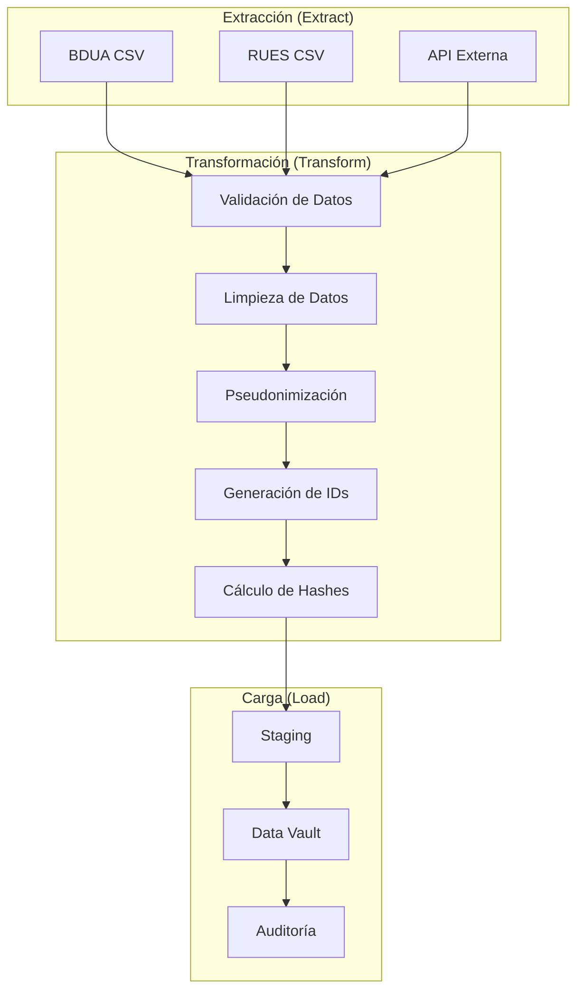

# Procesos ETL - SIRE

## Visión General

Los procesos ETL (Extract, Transform, Load) en SIRE están diseñados para procesar, validar y cargar datos estadísticos de manera eficiente y segura. El sistema implementa un pipeline ETL robusto que maneja múltiples fuentes de datos y garantiza la calidad e integridad de la información.

## Arquitectura ETL



## Fase de Extracción (Extract)

### 1. Fuentes de Datos

**BDUA (Base de Datos Única de Afiliados)**:
- ✅ Archivos CSV con datos de personas
- ✅ Información demográfica y de identificación
- ✅ Datos de afiliación y seguridad social
- ✅ Actualizaciones periódicas

**RUES (Registro Único Empresarial y Social)**:
- ✅ Archivos CSV con datos de empresas
- ✅ Información comercial y legal
- ✅ Datos de representantes legales
- ✅ Actualizaciones periódicas

**API Externa**:
- ✅ Servicios web para datos en tiempo real
- ✅ Validación de documentos
- ✅ Consulta de información actualizada
- ✅ Integración con sistemas externos

### 2. Estrategias de Extracción

**Extracción por Lotes (Batch)**:
```python
def extraer_datos_lote(fuente, fecha):
    """Extrae datos por lotes desde una fuente específica"""
    
    if fuente == "BDUA":
        return extraer_bdua_lote(fecha)
    elif fuente == "RUES":
        return extraer_rues_lote(fecha)
    else:
        raise ValueError(f"Fuente no soportada: {fuente}")

def extraer_bdua_lote(fecha):
    """Extrae datos de BDUA para una fecha específica"""
    
    # Construir ruta del archivo
    archivo = f"src/data/bdua_{fecha}.csv"
    
    # Verificar que el archivo existe
    if not os.path.exists(archivo):
        raise FileNotFoundError(f"Archivo no encontrado: {archivo}")
    
    # Leer archivo CSV
    df = spark.read.csv(archivo, header=True, inferSchema=True)
    
    # Agregar metadatos de extracción
    df = df.withColumn("fecha_extraccion", current_timestamp())
    df = df.withColumn("fuente_datos", lit("BDUA"))
    
    return df
```

**Extracción en Tiempo Real (Real-time)**:
```python
def extraer_datos_tiempo_real(api_endpoint, parametros):
    """Extrae datos en tiempo real desde una API"""
    
    # Realizar llamada a la API
    response = requests.get(api_endpoint, params=parametros)
    
    if response.status_code == 200:
        # Convertir respuesta a DataFrame
        data = response.json()
        df = spark.createDataFrame(data)
        
        # Agregar metadatos de extracción
        df = df.withColumn("fecha_extraccion", current_timestamp())
        df = df.withColumn("fuente_datos", lit("API"))
        
        return df
    else:
        raise Exception(f"Error en API: {response.status_code}")
```

**Extracción Incremental**:
```python
def extraer_datos_incremental(fuente, fecha_ultima_actualizacion):
    """Extrae solo datos nuevos o modificados"""
    
    # Obtener datos desde la última actualización
    df_nuevos = obtener_datos_desde_fecha(fuente, fecha_ultima_actualizacion)
    
    # Filtrar solo cambios
    df_cambios = filtrar_cambios(df_nuevos)
    
    # Agregar metadatos
    df_cambios = df_cambios.withColumn("tipo_extraccion", lit("INCREMENTAL"))
    
    return df_cambios
```

### 3. Validación de Extracción

**Validaciones de Archivos**:
```python
def validar_archivo_extraccion(archivo):
    """Valida que el archivo de extracción sea válido"""
    
    # Verificar que el archivo existe
    if not os.path.exists(archivo):
        raise FileNotFoundError(f"Archivo no encontrado: {archivo}")
    
    # Verificar tamaño del archivo
    tamaño = os.path.getsize(archivo)
    if tamaño == 0:
        raise ValueError("Archivo vacío")
    
    # Verificar formato del archivo
    if not archivo.endswith('.csv'):
        raise ValueError("Formato de archivo no soportado")
    
    # Verificar codificación
    try:
        with open(archivo, 'r', encoding='utf-8') as f:
            f.read(1024)  # Leer primeros 1KB
    except UnicodeDecodeError:
        raise ValueError("Codificación de archivo no válida")
    
    return True
```

**Validaciones de Datos**:
```python
def validar_datos_extraccion(df, esquema_esperado):
    """Valida que los datos extraídos cumplan con el esquema esperado"""
    
    # Verificar columnas requeridas
    columnas_requeridas = esquema_esperado.get("columnas_requeridas", [])
    columnas_faltantes = [col for col in columnas_requeridas if col not in df.columns]
    
    if columnas_faltantes:
        raise ValueError(f"Columnas faltantes: {columnas_faltantes}")
    
    # Verificar tipos de datos
    tipos_esperados = esquema_esperado.get("tipos_datos", {})
    for columna, tipo_esperado in tipos_esperados.items():
        if columna in df.columns:
            tipo_actual = df.schema[columna].dataType
            if not isinstance(tipo_actual, tipo_esperado):
                raise ValueError(f"Tipo de dato incorrecto en {columna}: esperado {tipo_esperado}, actual {tipo_actual}")
    
    # Verificar que no esté vacío
    if df.count() == 0:
        raise ValueError("Datos extraídos están vacíos")
    
    return True
```

## Fase de Transformación (Transform)

### 1. Validación de Datos

**Validaciones de Integridad**:
```python
def validar_integridad_datos(df):
    """Valida la integridad de los datos"""
    
    # Verificar valores nulos en campos requeridos
    campos_requeridos = ["tipo_documento", "numero_documento"]
    for campo in campos_requeridos:
        if campo in df.columns:
            nulos = df.filter(col(campo).isNull()).count()
            if nulos > 0:
                raise ValueError(f"Valores nulos encontrados en {campo}: {nulos}")
    
    # Verificar duplicados
    duplicados = df.count() - df.distinct().count()
    if duplicados > 0:
        raise ValueError(f"Duplicados encontrados: {duplicados}")
    
    return True
```

**Validaciones de Negocio**:
```python
def validar_reglas_negocio(df, tipo_entidad):
    """Valida las reglas de negocio específicas"""
    
    if tipo_entidad == "PERSONA":
        return validar_reglas_persona(df)
    elif tipo_entidad == "EMPRESA":
        return validar_reglas_empresa(df)
    else:
        raise ValueError(f"Tipo de entidad no soportado: {tipo_entidad}")

def validar_reglas_persona(df):
    """Valida reglas de negocio para personas"""
    
    # Validar formato de documento
    tipos_validos = ["CC", "CE", "TI", "RC"]
    df_invalido = df.filter(~col("tipo_documento").isin(tipos_validos))
    if df_invalido.count() > 0:
        raise ValueError(f"Tipos de documento inválidos: {df_invalido.select('tipo_documento').distinct().collect()}")
    
    # Validar formato de sexo
    sexos_validos = ["M", "F"]
    df_invalido = df.filter(~col("sexo_an").isin(sexos_validos))
    if df_invalido.count() > 0:
        raise ValueError(f"Sexos inválidos: {df_invalido.select('sexo_an').distinct().collect()}")
    
    # Validar fechas
    df_fecha_invalida = df.filter(col("fecha_nacimiento") > current_date())
    if df_fecha_invalida.count() > 0:
        raise ValueError("Fechas de nacimiento futuras encontradas")
    
    return True
```

### 2. Limpieza de Datos

**Normalización de Texto**:
```python
def normalizar_texto(df):
    """Normaliza texto en los datos"""
    
    # Normalizar nombres
    if "primer_nombre" in df.columns:
        df = df.withColumn("primer_nombre", upper(trim(col("primer_nombre"))))
    
    if "segundo_nombre" in df.columns:
        df = df.withColumn("segundo_nombre", upper(trim(col("segundo_nombre"))))
    
    if "primer_apellido" in df.columns:
        df = df.withColumn("primer_apellido", upper(trim(col("primer_apellido"))))
    
    if "segundo_apellido" in df.columns:
        df = df.withColumn("segundo_apellido", upper(trim(col("segundo_apellido"))))
    
    # Normalizar razón social
    if "razon_social" in df.columns:
        df = df.withColumn("razon_social", upper(trim(col("razon_social"))))
    
    return df
```

**Limpieza de Fechas**:
```python
def limpiar_fechas(df):
    """Limpia y normaliza fechas"""
    
    # Limpiar fecha de nacimiento
    if "fecha_nacimiento" in df.columns:
        df = df.withColumn("fecha_nacimiento", 
                          when(col("fecha_nacimiento").isNull(), None)
                          .otherwise(to_date(col("fecha_nacimiento"), "yyyy-MM-dd")))
    
    # Limpiar fecha de defunción
    if "fecha_defuncion" in df.columns:
        df = df.withColumn("fecha_defuncion", 
                          when(col("fecha_defuncion").isNull(), None)
                          .otherwise(to_date(col("fecha_defuncion"), "yyyy-MM-dd")))
    
    # Limpiar fechas de empresa
    if "fecha_matricula" in df.columns:
        df = df.withColumn("fecha_matricula", 
                          when(col("fecha_matricula").isNull(), None)
                          .otherwise(to_date(col("fecha_matricula"), "yyyy-MM-dd")))
    
    return df
```

**Limpieza de Números**:
```python
def limpiar_numeros(df):
    """Limpia y normaliza números"""
    
    # Limpiar número de documento
    if "numero_documento" in df.columns:
        df = df.withColumn("numero_documento", 
                          regexp_replace(col("numero_documento"), "[^0-9]", ""))
    
    # Limpiar dígito de verificación
    if "digito_verificacion" in df.columns:
        df = df.withColumn("digito_verificacion", 
                          when(col("digito_verificacion").isNull(), None)
                          .otherwise(regexp_replace(col("digito_verificacion"), "[^0-9]", "")))
    
    return df
```

### 3. Pseudonimización

**Generación de IDs Estadísticos**:
```python
def pseudonimizar_datos(df, tipo_entidad):
    """Pseudonimiza datos generando IDs estadísticos"""
    
    # Generar IDs estadísticos para cada registro
    df_con_ids = df.withColumn("id_estadistico", 
                              udf(lambda x: generar_id_estadistico(tipo_entidad, x), StringType())(
                                  struct(*[col(c) for c in df.columns])))
    
    return df_con_ids

def generar_id_estadistico(tipo_entidad, datos):
    """Genera un ID estadístico único"""
    
    # Llamar a la API FastAPI para generar ID
    response = requests.post(f"http://fastapi:8001/generar-id-{tipo_entidad.lower()}s", 
                           json=datos.asDict())
    
    if response.status_code == 200:
        result = response.json()
        return result["id_estadistico"]
    else:
        raise Exception(f"Error generando ID: {response.text}")
```

**Cálculo de Hashes**:
```python
def calcular_hashes(df):
    """Calcula hashes para las claves del Data Vault"""
    
    # Calcular hash_key para Hubs
    df = df.withColumn("hash_key", 
                      sha2(concat_ws("|", 
                                    col("tipo_documento"), 
                                    col("numero_documento")), 256))
    
    # Calcular hash_diff para Satellites
    columnas_descriptivas = [c for c in df.columns 
                           if c not in ["tipo_documento", "numero_documento", "hash_key"]]
    
    df = df.withColumn("hash_diff", 
                      sha2(concat_ws("|", *[col(c) for c in columnas_descriptivas]), 256))
    
    return df
```

### 4. Enriquecimiento de Datos

**Enriquecimiento con Códigos DIVIPOLA**:
```python
def enriquecer_con_divipola(df):
    """Enriquece datos con información de DIVIPOLA"""
    
    # Cargar datos de referencia DIVIPOLA
    df_divipola = spark.read.table("sire_ref.divipola")
    
    # Hacer join con datos de personas
    df_enriquecido = df.join(df_divipola, 
                           col("codigo_municipio_nacimiento") == col("codigo_municipio"), 
                           "left")
    
    return df_enriquecido
```

**Enriquecimiento con Tipos de Documento**:
```python
def enriquecer_con_tipos_documento(df):
    """Enriquece datos con información de tipos de documento"""
    
    # Cargar datos de referencia
    df_tipos = spark.read.table("sire_ref.tipo_documento")
    
    # Hacer join
    df_enriquecido = df.join(df_tipos, 
                           col("tipo_documento") == col("codigo_tipo"), 
                           "left")
    
    return df_enriquecido
```

## Fase de Carga (Load)

### 1. Carga en Staging

**Carga de Datos de Personas**:
```python
def cargar_staging_personas(df):
    """Carga datos de personas en staging"""
    
    # Agregar metadatos de carga
    df = df.withColumn("load_date", current_timestamp())
    df = df.withColumn("record_source", lit("SIRE_ETL"))
    
    # Cargar en tabla de staging
    df.write.mode("overwrite").jdbc(
        url=postgres_url,
        table="sire_sta.personas_sta",
        properties=postgres_properties
    )
    
    return df.count()
```

**Carga de Datos de Empresas**:
```python
def cargar_staging_empresas(df):
    """Carga datos de empresas en staging"""
    
    # Agregar metadatos de carga
    df = df.withColumn("load_date", current_timestamp())
    df = df.withColumn("record_source", lit("SIRE_ETL"))
    
    # Cargar en tabla de staging
    df.write.mode("overwrite").jdbc(
        url=postgres_url,
        table="sire_sta.empresas_sta",
        properties=postgres_properties
    )
    
    return df.count()
```

### 2. Carga en Data Vault

**Carga de Hubs**:
```python
def cargar_hubs(df_personas, df_empresas):
    """Carga datos en las tablas Hub del Data Vault"""
    
    # Cargar Hub Persona
    df_hub_persona = df_personas.select(
        col("id_estadistico").alias("hub_persona_key"),
        col("tipo_documento"),
        col("numero_documento"),
        col("hash_key"),
        col("load_date"),
        col("record_source")
    ).distinct()
    
    df_hub_persona.write.mode("append").jdbc(
        url=postgres_url,
        table="sire_dv.hub_persona",
        properties=postgres_properties
    )
    
    # Cargar Hub Empresa
    df_hub_empresa = df_empresas.select(
        col("id_estadistico").alias("hub_empresa_key"),
        col("tipo_documento"),
        col("numero_documento"),
        col("hash_key"),
        col("load_date"),
        col("record_source")
    ).distinct()
    
    df_hub_empresa.write.mode("append").jdbc(
        url=postgres_url,
        table="sire_dv.hub_empresa",
        properties=postgres_properties
    )
    
    return df_hub_persona.count() + df_hub_empresa.count()
```

**Carga de Satellites**:
```python
def cargar_satellites(df_personas, df_empresas):
    """Carga datos en las tablas Satellite del Data Vault"""
    
    # Cargar Satellite Persona
    df_sat_persona = df_personas.select(
        col("id_estadistico").alias("hub_persona_key"),
        col("primer_nombre"),
        col("segundo_nombre"),
        col("primer_apellido"),
        col("segundo_apellido"),
        col("fecha_nacimiento"),
        col("sexo_an"),
        col("codigo_municipio_nacimiento"),
        col("codigo_pais_nacimiento"),
        col("fecha_defuncion"),
        col("hash_diff"),
        col("load_date"),
        col("record_source")
    )
    
    df_sat_persona.write.mode("append").jdbc(
        url=postgres_url,
        table="sire_dv.sat_persona",
        properties=postgres_properties
    )
    
    # Cargar Satellite Empresa
    df_sat_empresa = df_empresas.select(
        col("id_estadistico").alias("hub_empresa_key"),
        col("razon_social"),
        col("digito_verificacion"),
        col("codigo_camara"),
        col("camara_comercio"),
        col("matricula"),
        col("fecha_matricula"),
        col("fecha_renovacion"),
        col("ultimo_ano_renovado"),
        col("fecha_vigencia"),
        col("fecha_cancelacion"),
        col("codigo_tipo_sociedad"),
        col("tipo_sociedad"),
        col("codigo_organizacion_juridica"),
        col("organizacion_juridica"),
        col("codigo_estado_matricula"),
        col("estado_matricula"),
        col("representante_legal"),
        col("num_identificacion_representante_legal"),
        col("clase_identificacion_rl"),
        col("fecha_actualizacion"),
        col("hash_diff"),
        col("load_date"),
        col("record_source")
    )
    
    df_sat_empresa.write.mode("append").jdbc(
        url=postgres_url,
        table="sire_dv.sat_empresa",
        properties=postgres_properties
    )
    
    return df_sat_persona.count() + df_sat_empresa.count()
```

**Carga de Links**:
```python
def cargar_links(df_personas, df_empresas):
    """Carga datos en las tablas Link del Data Vault"""
    
    # Crear Link Persona-Empresa
    df_link = df_personas.join(df_empresas, 
                              col("representante_legal") == col("primer_nombre"), 
                              "inner")
    
    df_link = df_link.select(
        concat(col("id_estadistico"), lit("_"), col("id_estadistico")).alias("link_persona_empresa_key"),
        col("id_estadistico").alias("hub_persona_key"),
        col("id_estadistico").alias("hub_empresa_key"),
        sha2(concat_ws("|", col("id_estadistico"), col("id_estadistico")), 256).alias("hash_key"),
        current_timestamp().alias("load_date"),
        lit("SIRE_ETL").alias("record_source")
    )
    
    df_link.write.mode("append").jdbc(
        url=postgres_url,
        table="sire_dv.link_persona_empresa",
        properties=postgres_properties
    )
    
    return df_link.count()
```

### 3. Carga en Auditoría

**Registro de Metadatos**:
```python
def registrar_metadatos_carga(job_name, start_time, end_time, records_processed, status):
    """Registra metadatos de la carga en auditoría"""
    
    metadatos = {
        'job_name': job_name,
        'start_time': start_time,
        'end_time': end_time,
        'duration_seconds': (end_time - start_time).total_seconds(),
        'records_processed': records_processed,
        'status': status,
        'created_date': datetime.now()
    }
    
    # Guardar en tabla de auditoría
    spark.createDataFrame([metadatos]).write.mode("append").jdbc(
        url=postgres_url,
        table="sire_audit.etl_log",
        properties=postgres_properties
    )
```

**Registro de Errores**:
```python
def registrar_errores_carga(job_name, error_message, error_details):
    """Registra errores de la carga en auditoría"""
    
    error_log = {
        'job_name': job_name,
        'error_message': error_message,
        'error_details': error_details,
        'error_date': datetime.now(),
        'status': 'ERROR'
    }
    
    # Guardar en tabla de auditoría
    spark.createDataFrame([error_log]).write.mode("append").jdbc(
        url=postgres_url,
        table="sire_audit.error_log",
        properties=postgres_properties
    )
```

## Orquestación ETL

### 1. DAG Principal

**Estructura del DAG**:
```python
from airflow import DAG
from airflow.operators.python_operator import PythonOperator
from datetime import datetime, timedelta

default_args = {
    'owner': 'sire-team',
    'depends_on_past': False,
    'start_date': datetime(2024, 1, 1),
    'email_on_failure': True,
    'email_on_retry': False,
    'retries': 3,
    'retry_delay': timedelta(minutes=5)
}

dag = DAG(
    'sire_etl_complete',
    default_args=default_args,
    description='ETL completo de SIRE',
    schedule_interval='@daily',
    catchup=False,
    max_active_runs=1
)

# Definir tareas
t1 = PythonOperator(
    task_id='extract_bdua_data',
    python_callable=extract_bdua_data,
    dag=dag
)

t2 = PythonOperator(
    task_id='extract_rues_data',
    python_callable=extract_rues_data,
    dag=dag
)

t3 = PythonOperator(
    task_id='transform_data',
    python_callable=transform_data,
    dag=dag
)

t4 = PythonOperator(
    task_id='load_data_vault',
    python_callable=load_data_vault,
    dag=dag
)

t5 = PythonOperator(
    task_id='cleanup_temp_files',
    python_callable=cleanup_temp_files,
    dag=dag
)

# Definir dependencias
t1 >> t3 >> t4 >> t5
t2 >> t3
```

### 2. Tareas ETL

**Extracción de Datos**:
```python
def extract_bdua_data(**context):
    """Extrae datos de BDUA"""
    
    # Obtener fecha de ejecución
    execution_date = context['execution_date']
    
    # Extraer datos
    df_bdua = extraer_datos_lote("BDUA", execution_date)
    
    # Validar extracción
    validar_archivo_extraccion(f"src/data/bdua_{execution_date}.csv")
    
    # Guardar en staging
    df_bdua.write.mode("overwrite").parquet(f"/tmp/sire_etl/bdua_{execution_date}")
    
    return f"Datos BDUA extraídos: {df_bdua.count()} registros"

def extract_rues_data(**context):
    """Extrae datos de RUES"""
    
    # Obtener fecha de ejecución
    execution_date = context['execution_date']
    
    # Extraer datos
    df_rues = extraer_datos_lote("RUES", execution_date)
    
    # Validar extracción
    validar_archivo_extraccion(f"src/data/rues_{execution_date}.csv")
    
    # Guardar en staging
    df_rues.write.mode("overwrite").parquet(f"/tmp/sire_etl/rues_{execution_date}")
    
    return f"Datos RUES extraídos: {df_rues.count()} registros"
```

**Transformación de Datos**:
```python
def transform_data(**context):
    """Transforma datos extraídos"""
    
    # Obtener fecha de ejecución
    execution_date = context['execution_date']
    
    # Cargar datos extraídos
    df_bdua = spark.read.parquet(f"/tmp/sire_etl/bdua_{execution_date}")
    df_rues = spark.read.parquet(f"/tmp/sire_etl/rues_{execution_date}")
    
    # Transformar datos de personas
    df_personas = transform_personas(df_bdua)
    
    # Transformar datos de empresas
    df_empresas = transform_empresas(df_rues)
    
    # Guardar datos transformados
    df_personas.write.mode("overwrite").parquet(f"/tmp/sire_etl/personas_transformed_{execution_date}")
    df_empresas.write.mode("overwrite").parquet(f"/tmp/sire_etl/empresas_transformed_{execution_date}")
    
    return f"Datos transformados: {df_personas.count()} personas, {df_empresas.count()} empresas"
```

**Carga de Datos**:
```python
def load_data_vault(**context):
    """Carga datos en el Data Vault"""
    
    # Obtener fecha de ejecución
    execution_date = context['execution_date']
    
    # Cargar datos transformados
    df_personas = spark.read.parquet(f"/tmp/sire_etl/personas_transformed_{execution_date}")
    df_empresas = spark.read.parquet(f"/tmp/sire_etl/empresas_transformed_{execution_date}")
    
    # Cargar en Data Vault
    count_hubs = cargar_hubs(df_personas, df_empresas)
    count_satellites = cargar_satellites(df_personas, df_empresas)
    count_links = cargar_links(df_personas, df_empresas)
    
    # Registrar metadatos
    registrar_metadatos_carga(
        "sire_etl_complete",
        context['start_date'],
        context['end_date'],
        count_hubs + count_satellites + count_links,
        "SUCCESS"
    )
    
    return f"Data Vault actualizado: {count_hubs + count_satellites + count_links} registros"
```

## Monitoreo y Calidad

### 1. Monitoreo de Performance

**Métricas de ETL**:
```python
def monitorear_performance_etl():
    """Monitorea el performance del proceso ETL"""
    
    # Obtener métricas de ejecución
    metrics = {
        'tiempo_total': get_tiempo_total(),
        'registros_procesados': get_registros_procesados(),
        'tasa_errores': get_tasa_errores(),
        'uso_recursos': get_uso_recursos()
    }
    
    # Guardar métricas
    spark.createDataFrame([metrics]).write.mode("append").jdbc(
        url=postgres_url,
        table="sire_audit.performance_metrics",
        properties=postgres_properties
    )
```

### 2. Validación de Calidad

**Validaciones de Calidad**:
```python
def validar_calidad_datos():
    """Valida la calidad de los datos cargados"""
    
    # Validar integridad referencial
    validar_integridad_referencial()
    
    # Validar completitud de datos
    validar_completitud_datos()
    
    # Validar consistencia de datos
    validar_consistencia_datos()
    
    # Validar exactitud de datos
    validar_exactitud_datos()
```

## Mejores Prácticas

### 1. Diseño de Procesos

- ✅ Mantener procesos simples y enfocados
- ✅ Implementar validaciones robustas
- ✅ Usar transacciones cuando sea necesario
- ✅ Documentar todos los procesos

### 2. Manejo de Errores

- ✅ Implementar manejo de errores graceful
- ✅ Registrar todos los errores
- ✅ Implementar reintentos automáticos
- ✅ Notificar errores críticos

### 3. Performance

- ✅ Optimizar consultas y transformaciones
- ✅ Usar particionamiento cuando sea necesario
- ✅ Implementar caching cuando sea apropiado
- ✅ Monitorear uso de recursos

### 4. Mantenimiento

- ✅ Limpiar archivos temporales
- ✅ Mantener logs organizados
- ✅ Actualizar documentación
- ✅ Revisar y optimizar procesos regularmente

## Conclusiones

Los procesos ETL en SIRE proporcionan:

- ✅ **Extracción eficiente**: Múltiples fuentes de datos
- ✅ **Transformación robusta**: Validaciones y limpieza
- ✅ **Carga optimizada**: Data Vault y auditoría
- ✅ **Orquestación**: Airflow para automatización
- ✅ **Monitoreo**: Métricas y calidad de datos
- ✅ **Escalabilidad**: Soporte para grandes volúmenes

Esta arquitectura ETL asegura que SIRE pueda procesar datos estadísticos de manera eficiente, segura y escalable.

