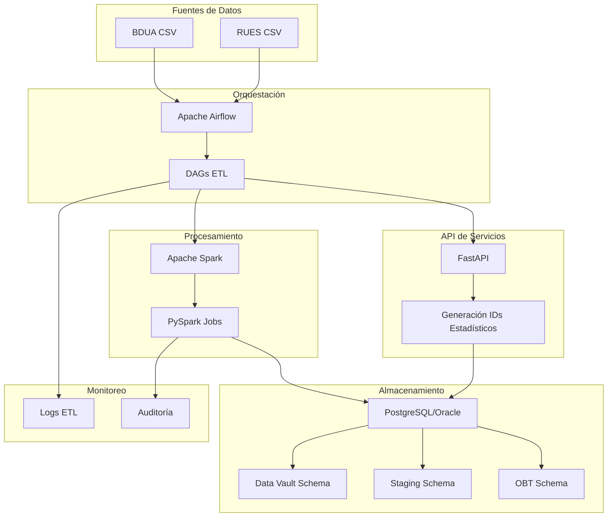
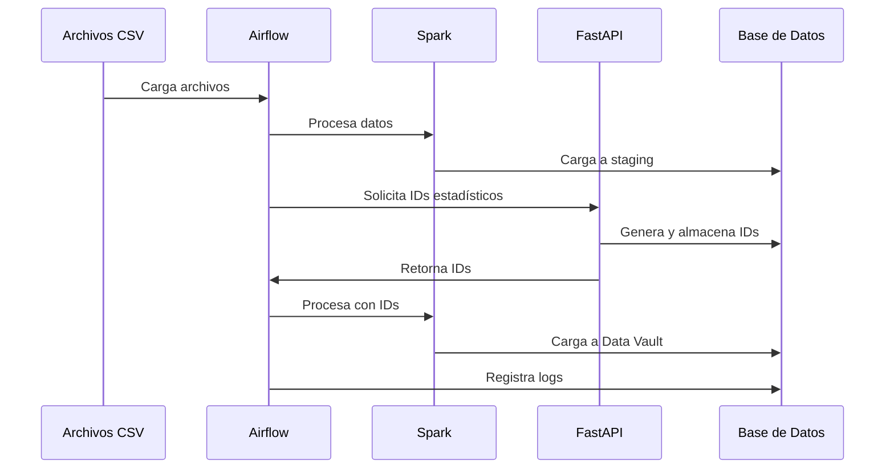

# Arquitectura del Sistema SIRE

## Visión General

SIRE (Sistema de Integración de Registros Estadísticos) es una plataforma ETL diseñada para procesar, pseudonimizar y almacenar datos estadísticos de manera segura y escalable. El sistema implementa la metodología Data Vault 2.0 y utiliza tecnologías modernas para garantizar la integridad, seguridad y auditoría de los datos.

## Arquitectura de Alto Nivel



## Componentes del Sistema

### 1. Orquestación (Apache Airflow)

**Propósito**: Coordinar y ejecutar los procesos ETL de manera programada y monitoreada.

**Componentes**:
- **Web Server**: Interfaz web para monitoreo y gestión
- **Scheduler**: Planificador de tareas
- **Executor**: Ejecutor de tareas (LocalExecutor)
- **DAGs**: Definiciones de flujos de trabajo

**Características**:
- Monitoreo en tiempo real
- Reintentos automáticos
- Logs detallados
- Interfaz web intuitiva

### 2. Procesamiento (Apache Spark)

**Propósito**: Procesamiento distribuido de grandes volúmenes de datos.

**Componentes**:
- **Spark Master**: Coordinador del cluster
- **Spark Workers**: Nodos de procesamiento
- **PySpark Jobs**: Trabajos de procesamiento de datos

**Características**:
- Procesamiento distribuido
- Tolerancia a fallos
- Escalabilidad horizontal
- Optimización automática

### 3. API de Servicios (FastAPI)

**Propósito**: Generar IDs estadísticos únicos para pseudonimización.

**Endpoints**:
- `POST /generar-id-personas`: Genera ID para personas
- `POST /generar-id-empresas`: Genera ID para empresas
- `POST /generar-id-empresas-cc`: Genera ID para empresas con CC

**Características**:
- API REST moderna
- Validación de datos con Pydantic
- Documentación automática
- Respuesta rápida

### 4. Almacenamiento (PostgreSQL/Oracle)

**Propósito**: Almacenar datos de manera estructurada siguiendo la metodología Data Vault.

**Esquemas**:
- **sire_sta**: Datos de staging (raw)
- **sire_obt**: Datos con información sensible
- **sire_dv**: Data Vault (datos pseudonimizados)

## Patrones de Arquitectura

### 1. Data Vault 2.0

El sistema implementa la metodología Data Vault 2.0 con los siguientes componentes:

#### Hubs
- **hub_persona**: Identificadores únicos de personas
- **hub_empresa**: Identificadores únicos de empresas

#### Satellites
- **sat_persona**: Atributos de personas (pseudonimizados)
- **sat_empresa**: Atributos de empresas (pseudonimizados)

#### Links
- **link_afiliacion**: Relaciones entre personas y empresas

### 2. Separación de Datos Sensibles

```
┌─────────────────┐    ┌─────────────────┐    ┌─────────────────┐
│   STAGING       │    │      OBT        │    │   DATA VAULT    │
│   (Raw Data)    │    │ (Sensitive)     │    │ (Pseudonymized) │
├─────────────────┤    ├─────────────────┤    ├─────────────────┤
│ • raw_bdua      │    │ • raw_obt_      │    │ • hub_persona   │
│ • raw_rues      │    │   personas      │    │ • sat_persona   │
│ • raw_log_etl   │    │ • raw_obt_      │    │ • hub_empresa   │
│                 │    │   empresas      │    │ • sat_empresa   │
│                 │    │                 │    │ • link_afiliacion│
└─────────────────┘    └─────────────────┘    └─────────────────┘
```

### 3. Flujo ETL



## Consideraciones de Seguridad

### 1. Pseudonimización
- Los datos sensibles se reemplazan con IDs estadísticos únicos
- Los IDs siguen un formato específico: `01` + consecutivo hexadecimal (personas), `02` + consecutivo hexadecimal (empresas)

### 2. Separación de Datos
- **Staging**: Datos raw sin procesar
- **OBT**: Datos con información sensible (acceso restringido)
- **Data Vault**: Datos pseudonimizados (acceso para análisis)

### 3. Auditoría
- Logs completos de todas las operaciones ETL
- Trazabilidad de cambios en los datos
- Registro de accesos y modificaciones

## Escalabilidad

### Horizontal
- Spark workers pueden agregarse dinámicamente
- Múltiples instancias de FastAPI
- Particionamiento de datos en Data Vault

### Vertical
- Aumento de recursos en contenedores
- Optimización de consultas SQL
- Caché de datos frecuentemente accedidos

## Monitoreo y Observabilidad

### 1. Logs
- Logs de Airflow para orquestación
- Logs de Spark para procesamiento
- Logs de FastAPI para servicios
- Logs de base de datos para operaciones

### 2. Métricas
- Tiempo de ejecución de DAGs
- Volumen de datos procesados
- Tasa de éxito/fallo de tareas
- Rendimiento de la API

### 3. Alertas
- Fallos en procesos ETL
- Tiempo de respuesta de API
- Uso de recursos del sistema
- Errores de base de datos

## Tecnologías Utilizadas

| Componente | Tecnología | Versión | Propósito |
|------------|------------|---------|-----------|
| Orquestación | Apache Airflow | 2.9.1 | Coordinación ETL |
| Procesamiento | Apache Spark | 3.5.5 | Procesamiento distribuido |
| API | FastAPI | 0.110.0 | Servicios REST |
| Base de Datos | PostgreSQL | 13 | Almacenamiento principal |
| Base de Datos | Oracle | 21c | Almacenamiento alternativo |
| Contenedores | Docker | Latest | Virtualización |
| Orquestación | Docker Compose | Latest | Gestión de contenedores |
| Lenguaje | Python | 3.9+ | Desarrollo principal |

## Consideraciones de Despliegue

### Desarrollo
- Docker Compose para entorno local
- PostgreSQL como base de datos
- Configuración simplificada

### Producción
- Kubernetes para orquestación
- Oracle como base de datos principal
- Configuración de alta disponibilidad
- Monitoreo y alertas avanzadas

## Próximos Pasos

1. **Optimización de Performance**
   - Implementación de índices optimizados
   - Particionamiento de tablas grandes
   - Caché de consultas frecuentes

2. **Seguridad Avanzada**
   - Encriptación de datos en tránsito
   - Autenticación multi-factor
   - Auditoría de accesos

3. **Escalabilidad**
   - Implementación de Kafka para streaming
   - Microservicios para componentes específicos
   - Auto-scaling basado en carga

4. **Analytics**
   - Dashboard de métricas en tiempo real
   - Alertas proactivas
   - Análisis de tendencias de datos
