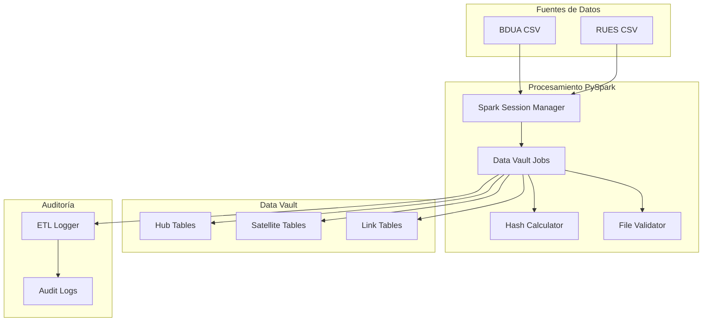

# Jobs de PySpark - SIRE

## Visión General

Los jobs de PySpark en SIRE son responsables del procesamiento de datos a gran escala, implementando la metodología Data Vault 2.0. Estos jobs procesan datos de fuentes como BDUA y RUES, los transforman y los cargan en el Data Warehouse.

## Arquitectura de PySpark Jobs



## Componentes Principales

### 1. Spark Session Manager

**Archivo**: `src/pyspark_jobs/spark/spark_session_manager.py`

**Propósito**: Gestiona la configuración y creación de sesiones de Spark.

**Características**:
- ✅ Configuración automática de Spark
- ✅ Manejo de recursos
- ✅ Configuración de logging
- ✅ Optimización de performance

**Configuración**:
```python
class SparkSessionManager:
    def __init__(self, app_name="SIRE_ETL"):
        self.app_name = app_name
        self.spark = None
    
    def create_session(self):
        """Crea una sesión de Spark optimizada"""
        self.spark = SparkSession.builder \
            .appName(self.app_name) \
            .config("spark.sql.adaptive.enabled", "true") \
            .config("spark.sql.adaptive.coalescePartitions.enabled", "true") \
            .config("spark.serializer", "org.apache.spark.serializer.KryoSerializer") \
            .getOrCreate()
        
        # Configurar logging
        self.spark.sparkContext.setLogLevel("WARN")
        
        return self.spark
```

### 2. Data Vault Jobs

#### Hub Jobs

**Archivo**: `src/pyspark_jobs/data_vault/hub/`

**Propósito**: Cargar datos en las tablas Hub del Data Vault.

**Jobs Disponibles**:
- `carga_hub_persona.py` - Carga datos de personas
- `carga_hub_entidad.py` - Carga datos de entidades
- `carga_hub_documento.py` - Carga datos de documentos

**Ejemplo - Hub Persona**:
```python
def carga_hub_persona(spark, df_personas):
    """Carga datos en la tabla hub_persona"""
    
    # Seleccionar campos del Hub
    hub_df = df_personas.select(
        col("id_estadistico").alias("hub_persona_key"),
        col("tipo_documento"),
        col("numero_documento"),
        col("hash_key"),
        col("load_date"),
        col("record_source")
    ).distinct()
    
    # Escribir en la tabla Hub
    hub_df.write \
        .mode("append") \
        .jdbc(
            url=postgres_url,
            table="sire_dv.hub_persona",
            properties=postgres_properties
        )
    
    return hub_df.count()
```

#### Satellite Jobs

**Archivo**: `src/pyspark_jobs/data_vault/satellite/`

**Propósito**: Cargar datos en las tablas Satellite del Data Vault.

**Jobs Disponibles**:
- `sat_persona.py` - Carga datos detallados de personas
- `sat_empresa.py` - Carga datos detallados de empresas

**Ejemplo - Satellite Persona**:
```python
def carga_sat_persona(spark, df_personas):
    """Carga datos en la tabla sat_persona"""
    
    # Seleccionar campos del Satellite
    sat_df = df_personas.select(
        col("id_estadistico").alias("hub_persona_key"),
        col("primer_nombre"),
        col("segundo_nombre"),
        col("primer_apellido"),
        col("segundo_apellido"),
        col("fecha_nacimiento"),
        col("sexo_an"),
        col("codigo_municipio_nacimiento"),
        col("codigo_pais_nacimiento"),
        col("fecha_defuncion"),
        col("hash_diff"),
        col("load_date"),
        col("record_source")
    )
    
    # Escribir en la tabla Satellite
    sat_df.write \
        .mode("append") \
        .jdbc(
            url=postgres_url,
            table="sire_dv.sat_persona",
            properties=postgres_properties
        )
    
    return sat_df.count()
```

### 3. Hash Calculator

**Archivo**: `src/pyspark_jobs/hash/hash_calculator.py`

**Propósito**: Calcula hashes para las claves del Data Vault.

**Funcionalidades**:
- ✅ Cálculo de hash_key (clave del Hub)
- ✅ Cálculo de hash_diff (diferencia del Satellite)
- ✅ Algoritmo SHA-256
- ✅ Normalización de datos

**Implementación**:
```python
class HashCalculator:
    def __init__(self):
        self.hash_algorithm = "SHA-256"
    
    def calculate_hash_key(self, df, business_keys):
        """Calcula hash_key para las claves de negocio"""
        # Concatenar claves de negocio
        concat_expr = concat_ws("|", *business_keys)
        
        # Calcular hash
        hash_expr = sha2(concat_expr, 256)
        
        return df.withColumn("hash_key", hash_expr)
    
    def calculate_hash_diff(self, df, descriptive_columns):
        """Calcula hash_diff para las columnas descriptivas"""
        # Concatenar columnas descriptivas
        concat_expr = concat_ws("|", *descriptive_columns)
        
        # Calcular hash
        hash_expr = sha2(concat_expr, 256)
        
        return df.withColumn("hash_diff", hash_expr)
```

### 4. File Validator

**Archivo**: `src/pyspark_jobs/validations/file_validator.py`

**Propósito**: Valida archivos de entrada antes del procesamiento.

**Validaciones**:
- ✅ Estructura del archivo
- ✅ Tipos de datos
- ✅ Valores requeridos
- ✅ Formato de fechas
- ✅ Códigos de validación

**Implementación**:
```python
class FileValidator:
    def __init__(self, spark):
        self.spark = spark
    
    def validate_bdua_file(self, file_path):
        """Valida archivo BDUA"""
        try:
            # Leer archivo
            df = self.spark.read.csv(file_path, header=True, inferSchema=True)
            
            # Validar columnas requeridas
            required_columns = [
                'tipo_documento', 'numero_documento', 'primer_nombre',
                'primer_apellido', 'fecha_nacimiento', 'sexo_an'
            ]
            
            missing_columns = [col for col in required_columns if col not in df.columns]
            if missing_columns:
                raise ValueError(f"Columnas faltantes: {missing_columns}")
            
            # Validar tipos de datos
            self._validate_data_types(df)
            
            # Validar valores
            self._validate_values(df)
            
            return True, "Archivo válido"
            
        except Exception as e:
            return False, str(e)
    
    def _validate_data_types(self, df):
        """Valida tipos de datos"""
        # Validar que fecha_nacimiento sea fecha
        df.filter(col("fecha_nacimiento").isNull()).count()
        
        # Validar que sexo_an sea M o F
        invalid_sex = df.filter(~col("sexo_an").isin(["M", "F"])).count()
        if invalid_sex > 0:
            raise ValueError(f"Valores inválidos en sexo_an: {invalid_sex} registros")
```

### 5. ETL Logger

**Archivo**: `src/pyspark_jobs/audit/etl_logger.py`

**Propósito**: Registra auditoría de todas las operaciones ETL.

**Funcionalidades**:
- ✅ Logging de inicio/fin de jobs
- ✅ Registro de errores
- ✅ Métricas de performance
- ✅ Trazabilidad de datos

**Implementación**:
```python
class ETLLogger:
    def __init__(self, spark):
        self.spark = spark
        self.log_table = "sire_audit.etl_log"
    
    def log_job_start(self, job_name, parameters):
        """Registra inicio de job"""
        log_entry = {
            'job_name': job_name,
            'start_time': datetime.now(),
            'parameters': json.dumps(parameters),
            'status': 'STARTED'
        }
        
        self._write_log(log_entry)
    
    def log_job_end(self, job_name, status, records_processed, error_message=None):
        """Registra fin de job"""
        log_entry = {
            'job_name': job_name,
            'end_time': datetime.now(),
            'status': status,
            'records_processed': records_processed,
            'error_message': error_message
        }
        
        self._write_log(log_entry)
    
    def _write_log(self, log_entry):
        """Escribe entrada de log"""
        log_df = self.spark.createDataFrame([log_entry])
        log_df.write \
            .mode("append") \
            .jdbc(
                url=postgres_url,
                table=self.log_table,
                properties=postgres_properties
            )
```

## Jobs Principales

### 1. Carga CSV a Base de Datos

**Archivo**: `src/pyspark_jobs/carga_csv_db.py`

**Propósito**: Carga archivos CSV a la base de datos.

**Funcionalidades**:
- ✅ Lectura de archivos CSV
- ✅ Validación de datos
- ✅ Transformación de tipos
- ✅ Carga a base de datos

**Implementación**:
```python
def carga_csv_db(file_path, table_name, schema_name="sire_sta"):
    """Carga archivo CSV a base de datos"""
    
    # Crear sesión Spark
    spark = SparkSessionManager().create_session()
    
    # Leer archivo CSV
    df = spark.read.csv(file_path, header=True, inferSchema=True)
    
    # Validar archivo
    validator = FileValidator(spark)
    is_valid, message = validator.validate_bdua_file(file_path)
    
    if not is_valid:
        raise ValueError(f"Archivo inválido: {message}")
    
    # Transformar datos
    df_transformed = transform_data(df)
    
    # Cargar a base de datos
    df_transformed.write \
        .mode("overwrite") \
        .jdbc(
            url=postgres_url,
            table=f"{schema_name}.{table_name}",
            properties=postgres_properties
        )
    
    return df_transformed.count()
```

### 2. Master Job de Data Vault

**Archivo**: `src/pyspark_jobs/data_vault/hub/hub_master_job.py`

**Propósito**: Orquesta la carga completa del Data Vault.

**Flujo de Trabajo**:
1. Cargar datos de staging
2. Procesar Hubs
3. Procesar Satellites
4. Procesar Links
5. Actualizar metadatos

**Implementación**:
```python
def ejecutar_data_vault_etl():
    """Ejecuta el proceso completo de Data Vault"""
    
    # Crear sesión Spark
    spark = SparkSessionManager().create_session()
    
    # Inicializar logger
    logger = ETLLogger(spark)
    logger.log_job_start("data_vault_etl", {})
    
    try:
        # 1. Cargar datos de staging
        df_personas = load_staging_data(spark, "personas")
        df_empresas = load_staging_data(spark, "empresas")
        
        # 2. Procesar Hubs
        hub_persona_count = carga_hub_persona(spark, df_personas)
        hub_empresa_count = carga_hub_empresa(spark, df_empresas)
        
        # 3. Procesar Satellites
        sat_persona_count = carga_sat_persona(spark, df_personas)
        sat_empresa_count = carga_sat_empresa(spark, df_empresas)
        
        # 4. Procesar Links
        link_count = carga_link_persona_empresa(spark, df_personas, df_empresas)
        
        # 5. Log de éxito
        total_records = hub_persona_count + hub_empresa_count + sat_persona_count + sat_empresa_count + link_count
        logger.log_job_end("data_vault_etl", "SUCCESS", total_records)
        
        return total_records
        
    except Exception as e:
        logger.log_job_end("data_vault_etl", "FAILED", 0, str(e))
        raise
```

## Configuración

### Variables de Entorno

```bash
# Configuración de Spark
SPARK_APP_NAME=SIRE_ETL
SPARK_MASTER=local[*]
SPARK_DRIVER_MEMORY=4g
SPARK_EXECUTOR_MEMORY=2g
SPARK_EXECUTOR_CORES=2

# Configuración de base de datos
POSTGRES_HOST=sire-postgres-dw
POSTGRES_PORT=5432
POSTGRES_USER=sire_user
POSTGRES_PASSWORD=sire_password
POSTGRES_DATABASE=sire_dw

# Configuración de archivos
DATA_PATH=/opt/sire/data
TEMP_PATH=/tmp/sire_etl
LOG_PATH=/opt/sire/logs
```

### Configuración de Spark

```python
# Configuración optimizada para SIRE
spark_config = {
    "spark.sql.adaptive.enabled": "true",
    "spark.sql.adaptive.coalescePartitions.enabled": "true",
    "spark.sql.adaptive.skewJoin.enabled": "true",
    "spark.serializer": "org.apache.spark.serializer.KryoSerializer",
    "spark.sql.execution.arrow.pyspark.enabled": "true",
    "spark.sql.adaptive.advisoryPartitionSizeInBytes": "128MB",
    "spark.sql.adaptive.coalescePartitions.minPartitionNum": "1",
    "spark.sql.adaptive.coalescePartitions.initialPartitionNum": "200"
}
```

## Monitoreo y Logs

### Configuración de Logging

```python
# Configuración de logging para PySpark
logging.basicConfig(
    level=logging.INFO,
    format='%(asctime)s - %(name)s - %(levelname)s - %(message)s',
    handlers=[
        logging.FileHandler('/opt/sire/logs/pyspark_jobs.log'),
        logging.StreamHandler()
    ]
)

# Configurar logging de Spark
spark.sparkContext.setLogLevel("WARN")
```

### Métricas de Performance

```python
def log_performance_metrics(spark, job_name, start_time, end_time, records_processed):
    """Registra métricas de performance"""
    
    duration = (end_time - start_time).total_seconds()
    
    metrics = {
        'job_name': job_name,
        'start_time': start_time,
        'end_time': end_time,
        'duration_seconds': duration,
        'records_processed': records_processed,
        'records_per_second': records_processed / duration if duration > 0 else 0,
        'spark_version': spark.version,
        'executor_count': spark.sparkContext.statusTracker().getExecutorInfos().__len__()
    }
    
    logging.info(f"Performance metrics: {metrics}")
    
    # Guardar métricas en base de datos
    metrics_df = spark.createDataFrame([metrics])
    metrics_df.write \
        .mode("append") \
        .jdbc(
            url=postgres_url,
            table="sire_audit.performance_metrics",
            properties=postgres_properties
        )
```

## Troubleshooting

### Problemas Comunes

#### Error de Memoria
```
Error: java.lang.OutOfMemoryError: Java heap space
```
**Solución**: Aumentar memoria del driver y executor:
```python
spark = SparkSession.builder \
    .config("spark.driver.memory", "8g") \
    .config("spark.executor.memory", "4g") \
    .getOrCreate()
```

#### Error de Conexión a Base de Datos
```
Error: connection timeout
```
**Solución**: Verificar configuración de conexión y timeout:
```python
postgres_properties = {
    "user": postgres_user,
    "password": postgres_password,
    "driver": "org.postgresql.Driver",
    "connectionTimeout": "30000",
    "socketTimeout": "30000"
}
```

#### Error de Particionamiento
```
Error: too many partitions
```
**Solución**: Optimizar particionamiento:
```python
df = df.coalesce(200)  # Reducir particiones
```

### Comandos de Debug

```bash
# Ver logs de Spark
docker logs -f sire-spark-driver

# Ver métricas de performance
spark-sql --conf spark.sql.adaptive.enabled=true

# Ver estado de jobs
spark-sql --conf spark.sql.adaptive.enabled=true --conf spark.sql.adaptive.coalescePartitions.enabled=true
```

## Mejores Prácticas

### 1. Optimización de Performance
- Usar particionamiento adecuado
- Implementar caching cuando sea necesario
- Optimizar consultas SQL
- Usar columnas apropiadas para joins

### 2. Manejo de Datos
- Validar datos de entrada
- Implementar transacciones
- Manejar errores gracefully
- Limpiar recursos

### 3. Monitoreo
- Implementar logging detallado
- Registrar métricas de performance
- Monitorear uso de recursos
- Implementar alertas

### 4. Seguridad
- Validar permisos de acceso
- Sanitizar datos de entrada
- Implementar auditoría
- Proteger credenciales

## Ejemplos de Uso

### Ejecutar Job Individual

```python
# Ejecutar carga de Hub Persona
from src.pyspark_jobs.data_vault.hub.carga_hub_persona import carga_hub_persona

spark = SparkSessionManager().create_session()
df_personas = load_personas_data(spark)
count = carga_hub_persona(spark, df_personas)
print(f"Registros procesados: {count}")
```

### Ejecutar Master Job

```python
# Ejecutar proceso completo de Data Vault
from src.pyspark_jobs.data_vault.hub.hub_master_job import ejecutar_data_vault_etl

total_records = ejecutar_data_vault_etl()
print(f"Total de registros procesados: {total_records}")
```

### Ejecutar desde Airflow

```python
# En un DAG de Airflow
def ejecutar_pyspark_job(**context):
    """Ejecuta job de PySpark desde Airflow"""
    
    # Configurar Spark
    spark = SparkSessionManager().create_session()
    
    # Ejecutar job
    result = ejecutar_data_vault_etl()
    
    return result
```
